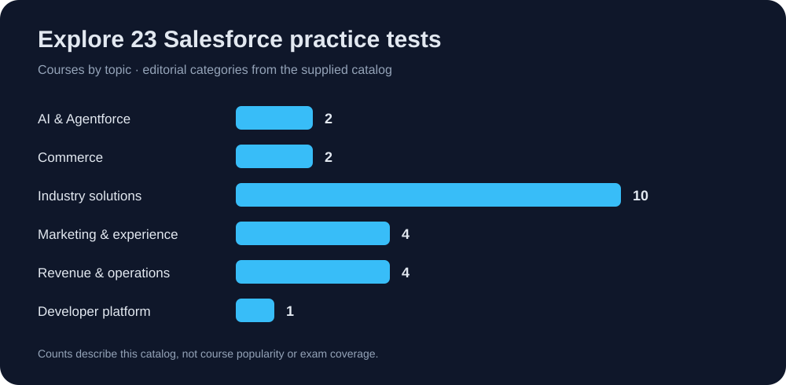

# Salesforce Practice Test Catalog

Find your next practice test. Browse by topic. Start preparing.

**23 courses** · **6 topics** · **Udemy links**

[Browse courses](#browse-courses) · [Download data](data/courses.csv) · [Contribute](CONTRIBUTING.md)

## About

A curated directory of Salesforce practice tests from the supplied course list. Each entry links directly to its Udemy course, with the original referral code preserved.

This is an independent catalog. It is not affiliated with or endorsed by Salesforce or Udemy. Course titles and exam identifiers come from the supplied list; availability, prices, exam alignment, and official accreditation have not been independently verified. Categories are editorial navigation aids.

## Browse courses

### AI & Agentforce

| Exam | Practice test |
| --- | --- |
| AP-222 | [Salesforce Accredited Agentforce 360 for Public Sector Professional Practice Test](https://www.udemy.com/course/salesforce-ap-222-agentforce-360-practice-exams/?referralCode=72A3DF9521363C2AE902) |
| AP-211 | [Salesforce AP-211 Agentforce Health Practice Tests](https://www.udemy.com/course/salesforce-ap-211-agentforce-health-practice-tests/?referralCode=A7EEA98350D6D06F05C3) |

### Commerce

| Exam | Practice test |
| --- | --- |
| AP-202 | [Salesforce AP-202 B2B Commerce Dev Practice Tests](https://www.udemy.com/course/salesforce-ap-202-b2b-commerce-dev-practice-tests/?referralCode=18C7985A5CBBD1AC592D) |
| AP-201 | [Salesforce AP-201 B2B Commerce Admin Practice Tests](https://www.udemy.com/course/salesforce-ap-201-b2b-commerce-admin-practice-tests/?referralCode=0B28A68FCA7F9C9AFAEE) |

### Industry solutions

| Exam | Practice test |
| --- | --- |
| AP-203 | [Salesforce AP-203 Communications Practice Tests](https://www.udemy.com/course/salesforce-ap-203-communications-practice-tests/?referralCode=276CF3A56EA26E3F61C5) |
| AP-204 | [Salesforce AP-204 Consumer Goods Practice Tests](https://www.udemy.com/course/salesforce-ap-204-consumer-goods-practice-tests/?referralCode=82899452AAFE88E614A3) |
| AP-205 | [Salesforce AP-205 Trade Promotion Practice Tests](https://www.udemy.com/course/salesforce-ap-205-trade-promotion-practice-tests/?referralCode=4CEF0A93F1C9627644C0) |
| AP-207 | [Salesforce AP-207 Energy Utilities Practice Tests](https://www.udemy.com/course/salesforce-ap-207-energy-utilities-practice-tests/?referralCode=DFB7B119F7D59D21C6C1) |
| AP-208 | [Salesforce AP-208 Financial Services Practice Tests](https://www.udemy.com/course/salesforce-ap-208-financial-services-practice-tests/?referralCode=17A08AA496F5F3B0A1FA) |
| AP-209 | [Salesforce AP-209 Field Service Practice Tests](https://www.udemy.com/course/salesforce-ap-209-field-service-practice-tests/?referralCode=8830E5A4A4E59926624D) |
| AP-213 | [Salesforce AP-213 Manufacturing Practice Tests](https://www.udemy.com/course/salesforce-ap-213-manufacturing-practice-tests/?referralCode=6C73761FE9CBD89C4312) |
| AP-217 | [Salesforce AP-217 Media Cloud Practice Tests](https://www.udemy.com/course/salesforce-ap-217-media-cloud-practice-tests/?referralCode=FE7F84058F585C560FB8) |
| AP-218 | [Salesforce AP-218 Net Zero Cloud Practice Tests](https://www.udemy.com/course/salesforce-ap-218-net-zero-cloud-practice-tests/?referralCode=CC036FDC698B4BBAB6A3) |
| AP-226 | [Salesforce AP-226 Contact Center Practice Tests](https://www.udemy.com/course/salesforce-ap-226-contact-center-practice-tests/?referralCode=7981693E5FFB090161EB) |

### Marketing & experience

| Exam | Practice test |
| --- | --- |
| AP-212 | [Salesforce AP-212 Loyalty Management Practice Tests](https://www.udemy.com/course/salesforce-ap-212-loyalty-management-practice-tests/?referralCode=084B5E695644F8A521CC) |
| AP-214 | [Salesforce AP-214 Cross Channel Practice Tests](https://www.udemy.com/course/salesforce-ap-214-cross-channel-practice-tests/?referralCode=C8A072A5B7FFFED7F424) |
| AP-215 | [Salesforce AP-215 MC Intelligence Practice Tests](https://www.udemy.com/course/salesforce-ap-215-mc-intelligence-practice-tests/?referralCode=09ABCAA6763D82BC2DEA) |
| AP-216 | [Salesforce AP-216 Personalization Practice Tests](https://www.udemy.com/course/salesforce-ap-216-personalization-practice-tests/?referralCode=A69A87CD610BEF16FD30) |

### Revenue & operations

| Exam | Practice test |
| --- | --- |
| AP-219 | [Salesforce AP-219 Order Management Admin Tests](https://www.udemy.com/course/salesforce-ap-219-order-management-admin-tests/?referralCode=579D62791935B49C7A2D) |
| AP-220 | [Salesforce AP-220 Order Management Dev Tests](https://www.udemy.com/course/salesforce-ap-220-order-management-dev-tests/?referralCode=FEF11A392420E2D90EFF) |
| AP-221 | [Salesforce AP-221 Process Automation Practice Tests](https://www.udemy.com/course/salesforce-ap-221-process-automation-practice-tests/?referralCode=FC9C4EAB8EC2145EF52F) |
| AP-223 | [Salesforce AP-223 CPQ and Billing Practice Tests](https://www.udemy.com/course/salesforce-ap-223-cpq-and-billing-practice-tests/?referralCode=1BFF4672F51D8C7D4B17) |

### Developer platform

| Exam | Practice test |
| --- | --- |
| AP-225 | [Salesforce AP-225 Heroku Developer Practice Tests](https://www.udemy.com/course/salesforce-ap-225-heroku-developer-practice-tests/?referralCode=F9857094EF17854A6478) |

## How to use

1. Choose a topic and exam code.
2. Open the course link and review its description, update date, and sample questions.
3. Compare it with the official exam guide before enrolling.
4. Use practice results to identify topics to revise.

## Repository files

| File | Purpose |
| --- | --- |
| `data/courses.json` | Structured course catalog |
| `data/courses.csv` | Spreadsheet-friendly catalog |
| `assets/course-topics.svg` | Accessible course-count graph |
| `CONTRIBUTING.md` | Update and submission guidance |
| `.github/ISSUE_TEMPLATE/` | Report a broken link or suggest a course |

## Link disclosure

Links contain referral codes supplied in the source list. Referral benefits, if any, depend on Udemy's terms. No discount or outcome is guaranteed.

## Updates

Catalog prepared on 3 October 2026. To report an incorrect title, outdated exam code, or broken link, open an issue with the relevant course URL.
